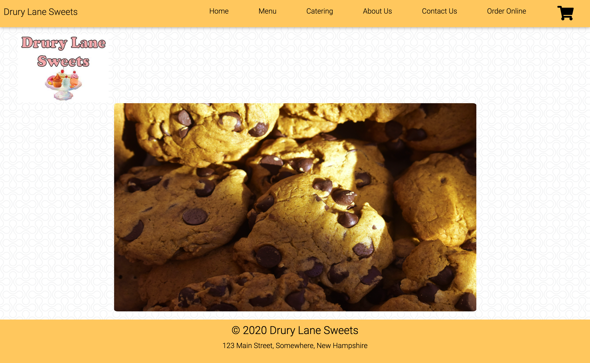

# Drury-Lane-Sweets
A dessert place website with online ordering and delivery capabilities, and provides catering services. Created using HTML, CSS, Javascript, JQuery, AJAX.

# Description:
Drury Lane Sweets is a local small business for baked goods. We make cakes, cupcakes, cookies, donuts, and pies. We also cater events customized to your needs. We created a dynamic website for our business. You can view our menu and order online, payment feature to be added soon. You can find nutrition info on our Menu page. You can find our location on a map on our Contact us page. We believe online ordering is very important in this day and age. We want people to be able to have treats delivered to their house/workplace. We also like customizing treats for events. We are motivated to cater to our customers and make them full of desserts.

# User Story: 
AS A person with a sweet tooth,
I WANT to order desserts online from a local bakery,
SO THAT I can satiate my dessert craving at home.

# Links:
- GitHub: https://github.com/JesalDM/dessert-place-website/
- Deployed Page: https://jesaldm.github.io/dessert-place-website/. 
- Screenshot: 
- Demo: 

# Technologies Used: 
HTML, CSS, JavaScript

# Libraries Used:
JQuery,  AJAX, Google Fonts, Font Awesome,

# Tools used
 Slack, GitHub, Balsamiq

# CSS Framework: 
Material Design Bootstrap

# API:
Nutritionix, Mapbox

# Collaborators
- Shannon Quinn (shannonquinn91)
- David Labins (Dlabins)
- Amy Upton (amybethupton)
- Brenda Burns (SSBurns-three)

# Challenges
- Switched framework from Semantic to MDBootstrap for better responsiveness
- Finding usable APIs
- GitHub merging

# Successes
- Carousel on home page 
- API functionality with modals
- Cart/online order functionality
- Nav bar responsiveness
- Local storage functionality

# For Future Development
- Online billing and payment system
- User login functionality
- User database and order history
- Expand menu
- Handling additional use cases such as
    a. retaining the cart if user navigates to other page and comes back 
    b. accidental closure of webpage
- Improved order tracking

# References
- Referred to a couple of dessert websites for catering menu content
    https://www.thedesserttray.com/
    https://www.swankdesserts.com/
- Images have been used from 
    https://unsplash.com/
    https://pixabay.com/

